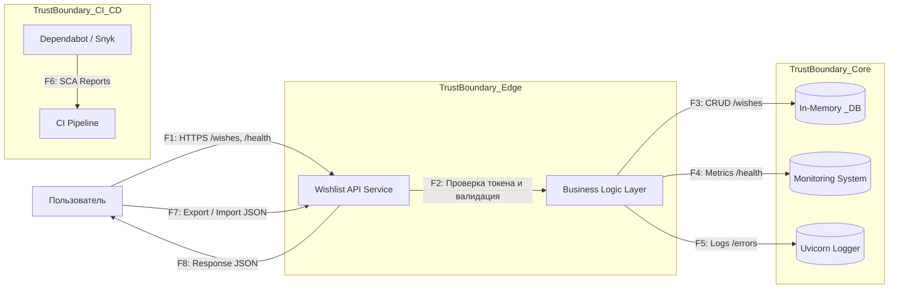
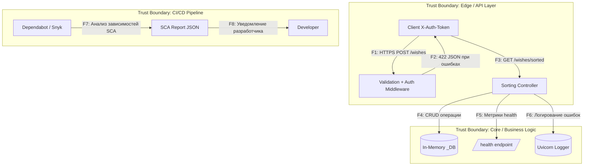

# Data Flow Diagram

## 1. Уровень 1 — Контекстная диаграмма

---

## 2. Пояснения к потокам

| Поток  | Описание                                            | Протокол / Механизм    | Применимые NFR | Потенциальные угрозы (STRIDE)     |
|--------|-----------------------------------------------------|------------------------|----------------|-----------------------------------|
| **F1** | Внешний запрос клиента к API (`/wishes`, `/health`) | HTTPS (TLS 1.2+)       | NFR-01, NFR-03 | Spoofing, Tampering               |
| **F2** | Проверка токена и валидация данных (Pydantic)       | FastAPI internal call  | NFR-02, NFR-03 | Tampering, Information Disclosure |
| **F3** | CRUD-операции с `_DB`                               | Внутренний Python API  | NFR-06         | Tampering, Repudiation            |
| **F4** | Отправка метрик `/health`                           | HTTP GET               | NFR-08         | Denial of Service                 |
| **F5** | Логирование ошибок и запросов                       | stdout (uvicorn.error) | NFR-07         | Information Disclosure            |
| **F6** | Отчёты анализа зависимостей                         | GitHub API / Snyk      | NFR-05         | Elevation of Privilege            |
| **F7** | Экспорт / импорт JSON-бэкапов                       | HTTPS                  | NFR-04         | Tampering, DoS                    |
| **F8** | Ответ API клиенту (JSON)                            | HTTPS                  | NFR-03         | Information Disclosure            |

---

## 3. Уровень 2 — Детализированный поток внутри Wishlist API

---

## 4. Trust Boundaries

| Граница         | Компоненты                                        | Потоки | Меры защиты                                         |
|-----------------|---------------------------------------------------|--------|-----------------------------------------------------|
| **Edge Layer**  | FastAPI маршруты `/wishes`, `/health`, middleware | F1–F3  | Проверка `X-Auth-Token`, HTTPS, Pydantic validation |
| **Core Layer**  | CRUD-логика, `_DB`, логирование, метрики          | F4–F6  | Изоляция данных, маскирование PII, fault tolerance  |
| **CI/CD Layer** | Dependabot, Snyk, GitHub Actions                  | F7–F8  | Контроль зависимостей, SLA на устранение CVE        |

---

## 5. Соответствие с NFR и STRIDE

| Поток / Компонент | STRIDE категория                    | Контроль (связанный NFR)     |
|-------------------|-------------------------------------|------------------------------|
| F1, F2            | **S** Spoofing / **T** Tampering    | `NFR-01`, `NFR-02`, `NFR-03` |
| F3, F4            | **T** Tampering / **R** Repudiation | `NFR-06`, `NFR-08`           |
